# Mermaid 基础图表

## 流程图

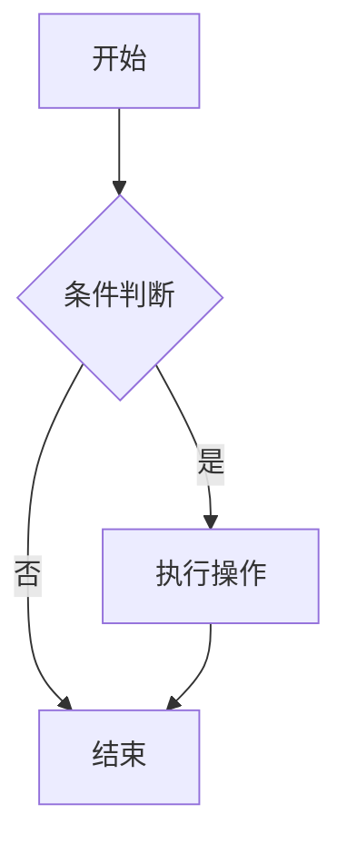
```mermaid
flowchart TD
    A[开始] --> B{条件判断}
    B -- 是 --> C[执行操作]
    B -- 否 --> D[结束]
    C --> D
```

## 时序图

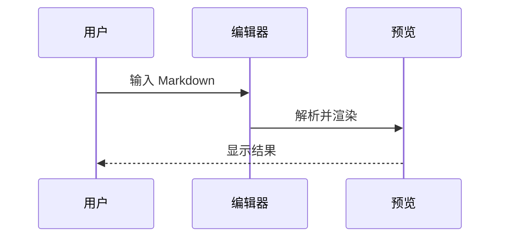
```mermaid
sequenceDiagram
    participant 用户
    participant 编辑器
    participant 预览
    用户->>编辑器: 输入 Markdown
    编辑器->>预览: 解析并渲染
    预览-->>用户: 显示结果
```

## 类图

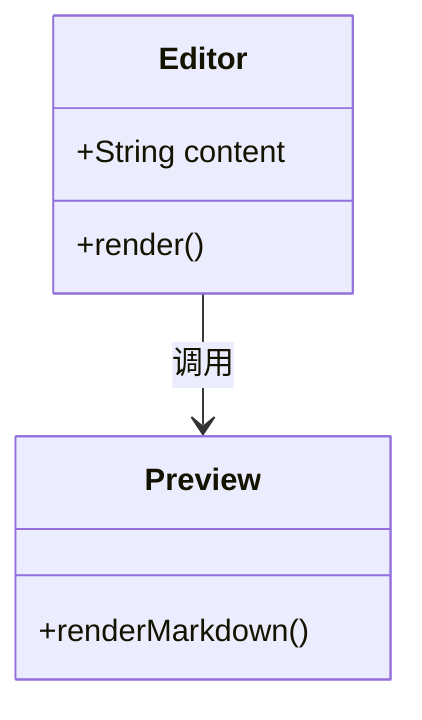
```mermaid
classDiagram
    class Editor {
        +String content
        +render()
    }
    class Preview {
        +renderMarkdown()
    }
    Editor --> Preview : 调用
```

## 状态图

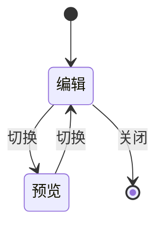
```mermaid
stateDiagram-v2
    [*] --> 编辑
    编辑 --> 预览 : 切换
    预览 --> 编辑 : 切换
    编辑 --> [*] : 关闭
```

## ER 图

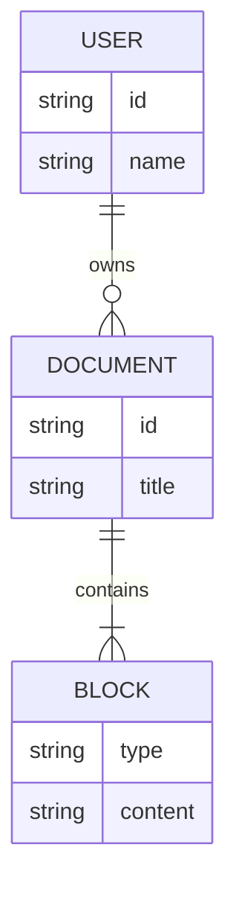
```mermaid
erDiagram
    USER ||--o{ DOCUMENT : owns
    DOCUMENT ||--|{ BLOCK : contains
    USER {
        string id
        string name
    }
    DOCUMENT {
        string id
        string title
    }
    BLOCK {
        string type
        string content
    }
```

## 甘特图

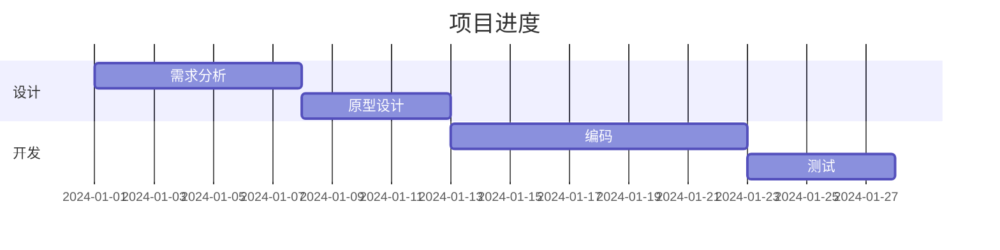
```mermaid
gantt
    title 项目进度
    dateFormat  YYYY-MM-DD
    section 设计
    需求分析 :a1, 2024-01-01, 7d
    原型设计 :a2, after a1, 5d
    section 开发
    编码 :b1, after a2, 10d
    测试 :b2, after b1, 5d
```

## 饼图

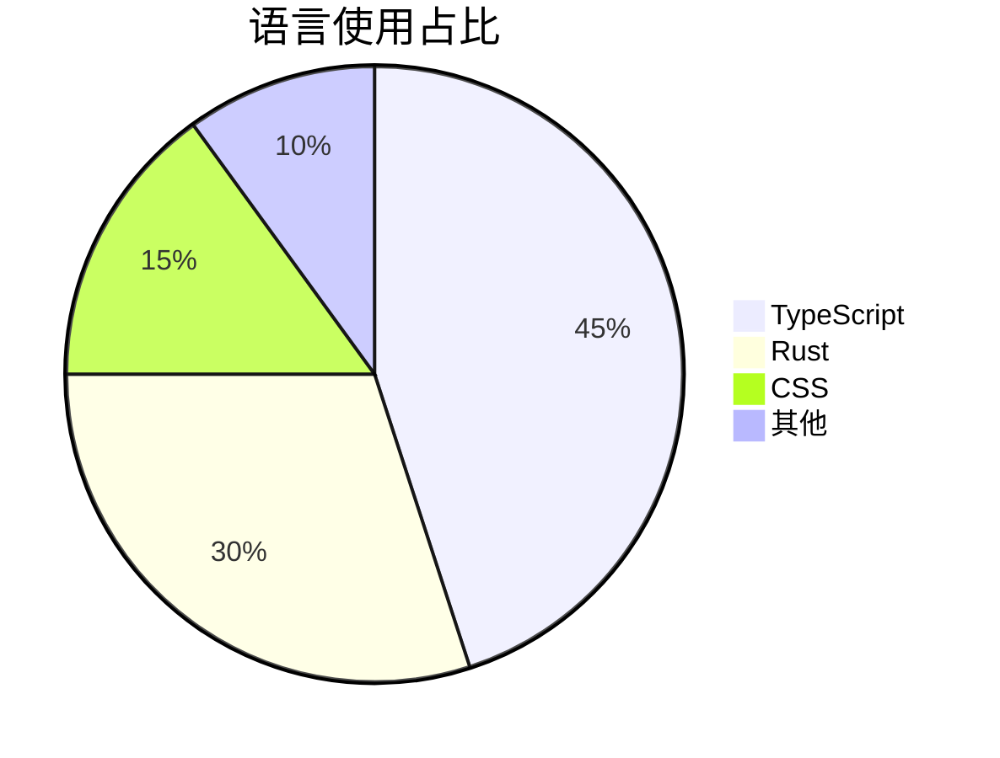
```mermaid
pie title 语言使用占比
    "TypeScript" : 45
    "Rust" : 30
    "CSS" : 15
    "其他" : 10
```

## 思维导图

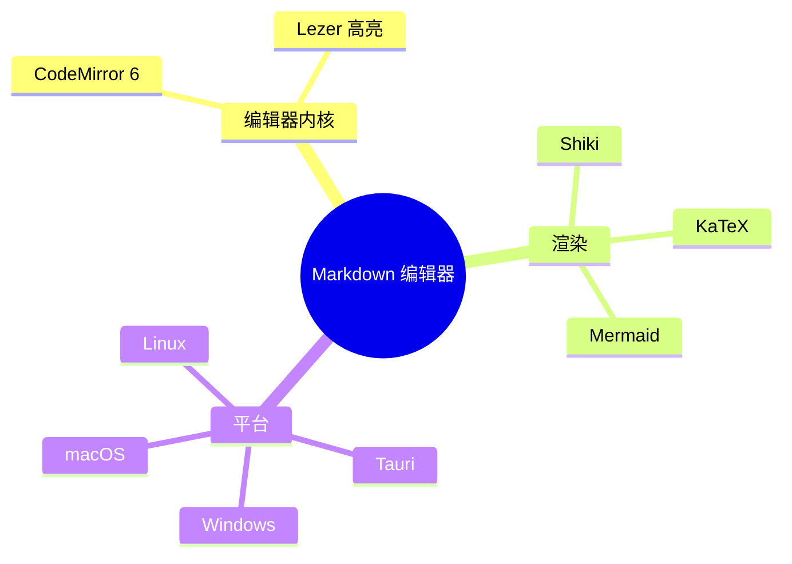
```mermaid
mindmap
  root((Markdown 编辑器))
    编辑器内核
      CodeMirror 6
      Lezer 高亮
    渲染
      Shiki
      KaTeX
      Mermaid
    平台
      Tauri
      Windows
      macOS
      Linux
```

## Git 图

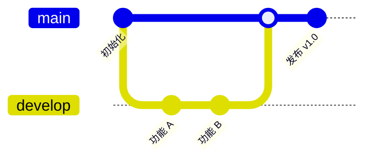
```mermaid
gitGraph
    commit id: "初始化"
    branch develop
    checkout develop
    commit id: "功能 A"
    commit id: "功能 B"
    checkout main
    merge develop
    commit id: "发布 v1.0"
```

## 时间线

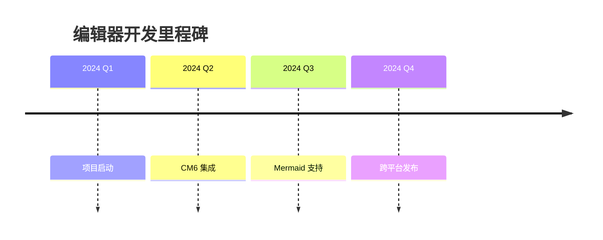
```mermaid
timeline
    title 编辑器开发里程碑
    2024 Q1 : 项目启动
    2024 Q2 : CM6 集成
    2024 Q3 : Mermaid 支持
    2024 Q4 : 跨平台发布
```

## 象限图

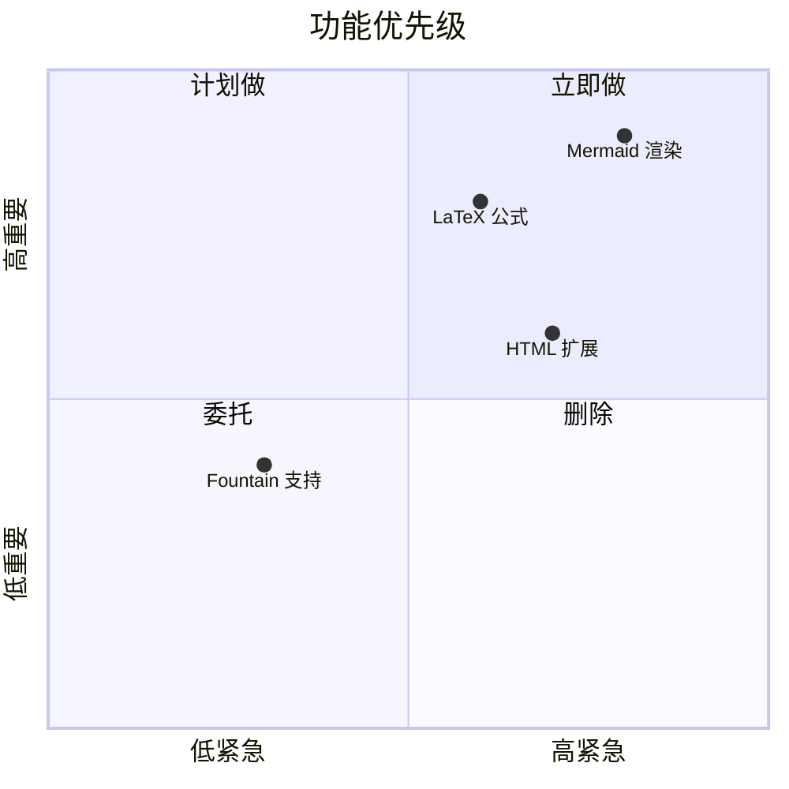
```mermaid
quadrantChart
    title 功能优先级
    x-axis 低紧急 --> 高紧急
    y-axis 低重要 --> 高重要
    quadrant-1 立即做
    quadrant-2 计划做
    quadrant-3 委托
    quadrant-4 删除
    Mermaid 渲染: [0.8, 0.9]
    LaTeX 公式: [0.6, 0.8]
    Fountain 支持: [0.3, 0.4]
    HTML 扩展: [0.7, 0.6]
```